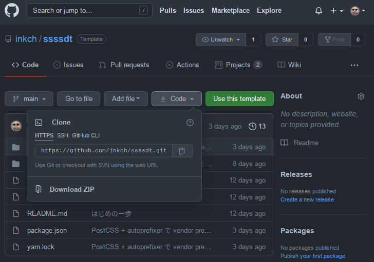

# ssssdt

<strong>S</strong>uper
<strong>S</strong>imple
<strong>S</strong>tatic
<strong>S</strong>ite
<strong>D</strong>evelopment
<strong>T</strong>emplate

静的な Web ページを開発するためのシンプルなテンプレートリポジトリです。
数ページ、多くても十数ページの制作を想定しています。


## 依存するツール・パッケージ

- NodeJS LTS
- yarn 1.22


## 使い方


### 準備


#### ダウンロード

zip でダウンロードするか、`Use this template` を使ってください。





#### パッケージのインストール

```console
$ yarn
```


### 開発

ここでは開発手順を簡単に説明します。

ディレクトリの構造、ビルド工程の詳細については[こちら](./docs/ARCHITECTURE.md)を参照してください。


#### ビルド

```
$ yarn build
```

`src` ディレクトリ以下のファイルを `public` に出力します。


#### 開発用サーバの起動と、ファイル変更の検知 + livereload

```
$ yarn dev
```


1. 開発用のローカルサーバを起動
2. livereload を起動
3. `src` ディレクトリ以下のファイルの変更を検知し適宜 `public` に出力
