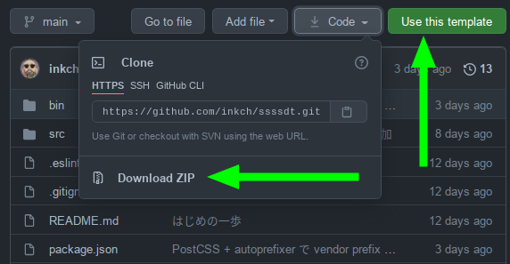

# ssssdt

<strong>S</strong>uper
<strong>S</strong>imple
<strong>S</strong>tatic
<strong>S</strong>ite
<strong>D</strong>evelopment
<strong>T</strong>emplate

静的な Web ページを開発するためのシンプルなテンプレートリポジトリです。
数ページ、多くても十数ページの制作を想定しています。


`src` ディレクトリ以下のファイルを適宜 `public` 以下に出力します。
下記の機能を提供します。

- `.ejs` を `.html` に変換する
- `.scss`, `.sass` を `.css` に変換する
- `.js` をバンドルしブラウザで実行可能な形に変換する
- `static` 以下のディレクトリ・ファイルをコピーする


## 依存するツール

- NodeJS LTS
- yarn 1.22


## 使い方

### 本テンプレートのダウンロード

zip でダウンロードするか、`Use this template` を使ってください。





### 開発

ここでは開発手順を簡単に説明します。
ディレクトリの構造、ビルド工程の詳細については[こちら](./docs/ARCHITECTURE.md)を参照してください。


#### 依存パッケージのインストール

ダウンロード、もしくはクローンしたディレクトリで以下のコマンドを実行してください。

```console
$ yarn
```

本テンプレートは `yarn` の利用を想定していますが、`npm` を使うこともできます。
`npm` を使う場合は `yarn.lock` ファイルを削除しましょう。

```
$ rm yarn.lock
$ npm install
```


#### ビルド

以下のコマンドで `src` ディレクトリ以下のファイルを `public` に出力します。

```
$ yarn build
```

`npm` を使う場合は

```
$ npm run build
```


#### 開発用サーバの起動と、ファイル変更の検知 + livereload

下のコマンドで、以下を実行します:

    1. 開発用のローカルサーバを起動
    2. livereload を起動
    3. `src` ディレクトリ以下のファイルの変更を検知し適宜 `public` に出力


```
$ yarn dev
```

`npm` を使う場合は

```
$ npm run dev
```
